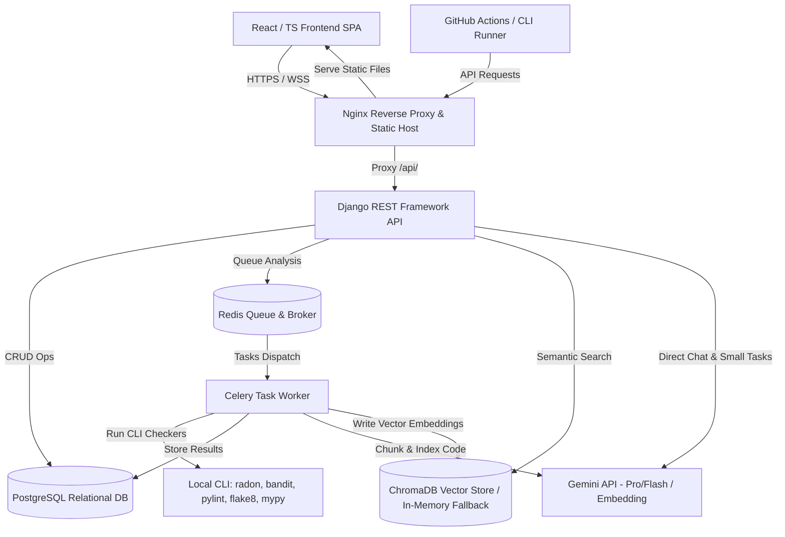

# System Design Document
## AI-Powered Secure Code Intelligence Platform

---

### 1. System Architecture Diagram

---

### 2. Component Descriptions

#### 2.1. Frontend Web SPA (React + TypeScript)
- Built on Vite with Tailwind CSS styling and Recharts visualization.
- Communicates exclusively with the API via the `/api/` route configured as a proxy.
- Pages:
  - **Dashboard**: High-level code score overview, open issues count, active code debt ratio.
  - **Code Analyzer**: In-browser repository file inspector, source code visualizer, interactive AI review explainer, and RAG context search engine.
  - **Security Dashboard**: Visualized compliance checklist, CVSS score distribution histograms, and OWASP category heatmaps.
  - **Technical Debt Analyzer**: Cyclomatic complexity breakdowns, maintainability gauges, and actionable refactoring cards.
  - **Team Analytics**: Leaderboard metrics, scan frequency graphs, and API usage tracking.

#### 2.2. Django API Core Gateway
- Serves as the central state controller.
- Employs standard Django models mapping projects, repositories, analysis history, issues, security audits, and configuration settings.
- Exposes RESTful endpoints using Django REST Framework (DRF) serializers.

#### 2.3. Celery & Redis Task Engine
- Processes compute-heavy operations.
- The web server dispatches jobs (like pulling a repository, running static linting utilities, or vectorizing code files) to Redis as JSON-serialized payloads.
- Workers spawn sub-processes for static checking and update the relational database with statuses and results.

#### 2.4. Static Analysis Integration
- Integrates five major open-source checkers:
  1. `Radon`: Computes Cyclomatic Complexity (CC), Maintainability Index (MI), and raw lines of code (LOC).
  2. `Bandit`: Scans Python code for common security vulnerabilities.
  3. `Pylint` / `Flake8`: Evaluates style guides, syntax warnings, and coding standards.
  4. `Mypy`: Verifies static type constraints.
- A robust abstract syntax tree (AST) helper processes files in the event of missing executable checkers or platform-specific execution errors.

#### 2.5. Vector Index & RAG Search System
- Chunks repository files (by function boundaries or sliding-window lines).
- Invokes the `text-embedding-004` API to generate 768-dimension vectors.
- Stores coordinates in ChromaDB. If ChromaDB dependencies fail to initialize in local development environments, a **pure-Python fallback** engine computes cosine similarity using matrix transformations on cached local coordinates.

---

### 3. Core Database Models

#### 3.1. AnalysisJob
- Tracks scan execution state.
- Fields: `project`, `status` (PENDING, RUNNING, COMPLETED, FAILED), `created_at`, `duration`.

#### 3.2. CodeIssue
- Individual issues identified in the source files.
- Fields: `job`, `file_path`, `line_number`, `checker`, `message`, `severity` (HIGH, MEDIUM, LOW), `category`.

#### 3.3. SecurityIssue
- Mapped vulnerabilities.
- Fields: `job`, `file_path`, `line_number`, `vulnerability_name`, `cvss_score`, `risk_level`, `owasp_category`, `remediation_steps`.

#### 3.4. TechnicalDebtReport
- Aggregated health score metrics.
- Fields: `job`, `maintainability_index`, `cyclomatic_complexity`, `total_loc`, `debt_ratio_percent`.
